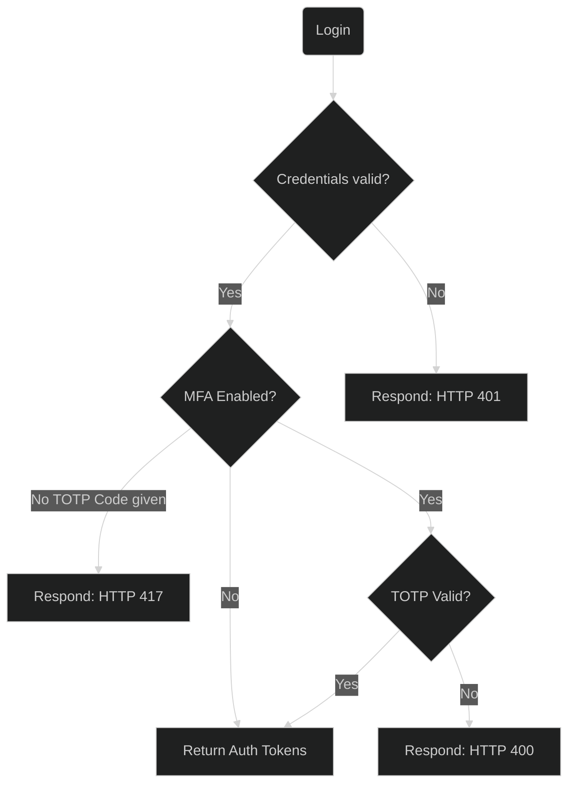

# OTP

Users will enter email and password which backend checks

1. If credentials are valid,
2. And TOTP is enabled,
3. Then return `417 Expectation Failed` response,
4. Given `HTTP 417` response,
5. Then clients should present TOTP code with the same authentication credentials.



## OTP activation

When users enable MFA the following things happen:

1. Endpoint `POST /mfa/enable` generates TOTP secret,
2. Sends QR code as base64 image and TOTP secret,
3. Client scans and creates OTP client,
4. Then enters TOTP code which,
5. Then sent to `POST /mfa/setup` alongside with secret,
6. On backend we encrypt TOTP code,
7. Then generate backup codes,
8. Then encrypt backup codes,
9. Then save TOTP secret and backup codes and secure encryption key,
10. Then return backup codes to user,
11. Done.

## Schema level
Users' table and schemas have the following fields the last two of which are encrypted with
private key and if users have MFA enabled we decrypt TOTP secret to verify given TOTP code.
To reset MFA we also keep backup codes in encrypted form and only decrypt to verify if
given backup code is correct.

Both encrypted fields have the following format `system_key_hash:base64_key_contents`.

```py
class User:
    ...
    mfa_enabled: bool
    mfa_encrypted_secret: SomeStr
    mfa_encrypted_backup_codes: SomeStr
```
